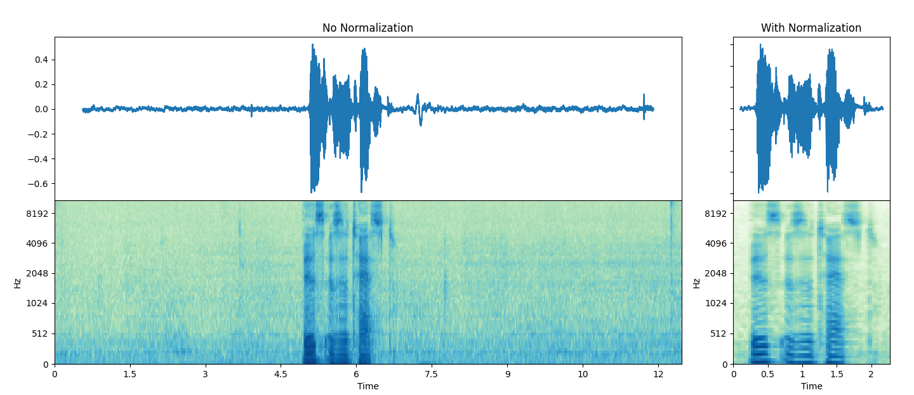

## PreprocesingForTTS

Preprocessing utillity for text and audio to be used in Text-to-Speech. Can transform text into a phoneme ID tensor or a
articulatory vector representation tensor, can clean and normalize a wav, can produce a mel filterbank from a wave. There are many settings that can (and should) be tweaked.

### Example: Text-to-Vector

| "Hello world, this is a test!"| həloʊwɜld~ðɪsɪzɐtɛst!| [ 88, 113,  93, 105, 123,  90, 117,  93,  29,  12,  54, 120,  49, 120, 52, 124,  32, 118,  49,  32,  10] |
| -------------|-----------|---------------------| 

### Example: Wave-to-Filterbank




## Installation

Just doing _pip install -r requirements.txt_ should be sufficient, but in case you want to do it manually, here are special cases:

- In the text processing, one module is imported as 'cleantext'. This can however **NOT** be installed using _pip install cleantext_, which gives you a different module. You need to do _pip install clean-text_ (as is in the requirements)

- To install torchaudio using conda you have to specify the host channel, which is pytorch. Download may be very slow due to their hosting.  
_conda install -c pytorch torchaudio_

## Sources 

### Text Processing

The phonemizer can be found at https://github.com/bootphon/phonemizer and is using espeak in the backend.

The text cleaner can be found at https://github.com/jfilter/clean-text.

### Audio Processing

Some of the audio processing is done using Librosa:

```
@inproceedings{mcfee2015librosa,
  title={librosa: Audio and music signal analysis in python},
  author={McFee, Brian and Raffel, Colin and Liang, Dawen and Ellis, Daniel PW and McVicar, Matt and Battenberg, Eric and Nieto, Oriol},
  booktitle={Proceedings of the 14th python in science conference},
  volume={8},
  pages={18--25},
  year={2015},
  organization={Citeseer}
}
```

Audio processing also uses pyloudnorm:

```
Christian Steinmetz, csteinmetz1/pyloudnorm: 0.1.0 (Version v0.1.0), Zenodo, November 2019
```

And a lot of the audio processing is done using the torchaudio module of PyTorch:

```
@incollection{NEURIPS2019_9015,
title = {PyTorch: An Imperative Style, High-Performance Deep Learning Library},
author = {Paszke, Adam and Gross, Sam and Massa, Francisco and Lerer, Adam and Bradbury, James and Chanan, Gregory and Killeen, Trevor and Lin, Zeming and Gimelshein, Natalia and Antiga, Luca and Desmaison, Alban and Kopf, Andreas and Yang, Edward and DeVito, Zachary and Raison, Martin and Tejani, Alykhan and Chilamkurthy, Sasank and Steiner, Benoit and Fang, Lu and Bai, Junjie and Chintala, Soumith},
booktitle = {Advances in Neural Information Processing Systems 32},
editor = {H. Wallach and H. Larochelle and A. Beygelzimer and F. d\textquotesingle Alch\'{e}-Buc and E. Fox and R. Garnett},
pages = {8024--8035},
year = {2019},
publisher = {Curran Associates, Inc.},
url = {http://papers.neurips.cc/paper/9015-pytorch-an-imperative-style-high-performance-deep-learning-library.pdf}
}
```

### This Repository

If you want to refer to this repo, you can use the following:

```
@misc{flux2021preprocessing,
  author = {Florian Lux},
  title = {PreprocessingForTTS},
  year = {2021},
  journal = {GitHub repository},
  howpublished = {\url{https://github.com/Flux9665/PreprocessingForTTS}}
}
```
